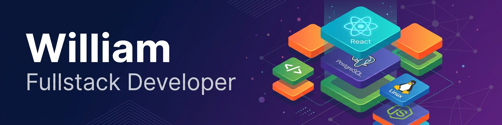
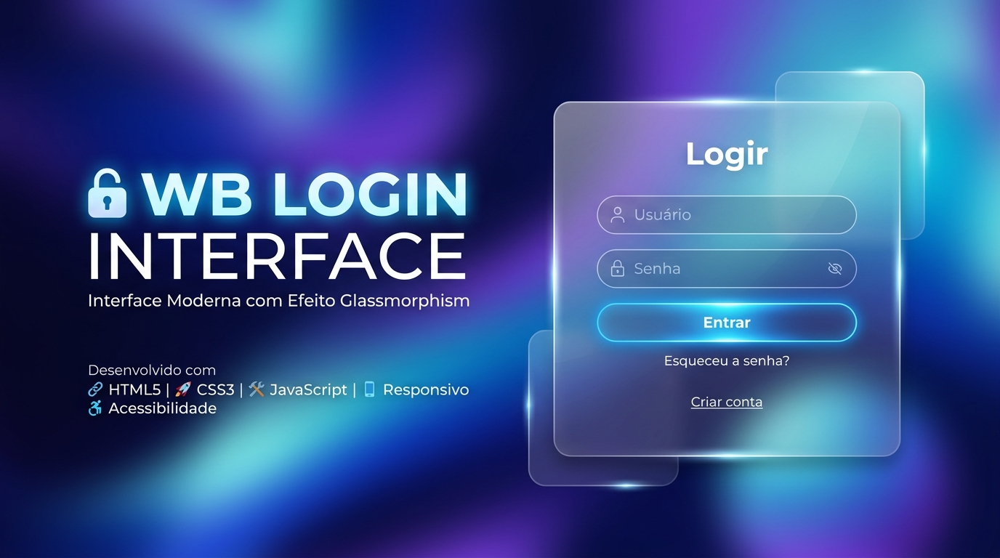

Olá, eu sou o <strong>William!</strong>

  Estou construindo minha carreira em desenvolvimento web, aprendendo na prática e colocando meus estudos em projetos reais. 
  Aqui compartilho meus projetos, estudos e experiências durante essa jornada. 
  Atualmente estou focado em evoluir como desenvolvedor Full Stack, explorando desde o Front-End até o Back-End.

 

<h2> 
   Projetos em destaque 
</h2>

<!-- Seção de projetos -->

<section>

Principais projetos desenvolvidos até o momento.

<table>
  <tr>
  <td align="center" width="50%">

  

  <strong>Landing Page desenvolvido para cliente.</strong>

  <a href="https://rosanabritoesteticista.vercel.app/" target="_blank"> Ver projeto </a>

  </td>

  <td align="center" width="50%">

  

  <strong>Uma página de login simples e bonita.</strong>

  
    <a href="https://tela-login-projeto.vercel.app/" target="_blank">Ver projeto</a>
    <a href="https://github.com/williambrito55/tela-login" target="_blank">Repositório</a>
  
  </td>
  </tr>
</table>

</section>

  

<h2> Stack & Tools </h2>

<!-- Seção de stacks e ferramentas -->
<section>

Algumas stacks que mais utilizo em meus projetos.

  

<!-- HTML ícone -->

<!-- CSS ícone -->

<!-- TailwindCSS ícone -->

          
<!-- JavaScript ícone -->

<!-- React.js ícone -->

<!-- Node.js ícone -->

<!-- NPM ícone -->

<!-- Java ícone -->

<!-- PostgreSQL ícone -->

<!-- Git ícone -->
  

          
<!-- GitHub ícone -->

<!-- VS Code ícone -->

<!-- Bash  ícone -->

<!-- ZSH ícone -->

          
<!-- Debian ícone -->

<!-- Vercel ícone -->

</section>

  

<!-- Git Stats -->

<h2 align="center">Git Stats</h2>

<section>

Resumo do meu GitHub.

 

  
<!-- Card linguagens mais usadas -->
  
  

  
  <!-- Card commits -->
  
  

</section>

 

<h2> 
 Conecte-se comigo </h2>

Se quiser trocar uma ideia sobre desenvolvimento, projetos ou tecnologia, pode me encontrar por aqui:

  
  

